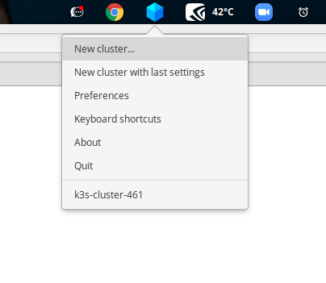
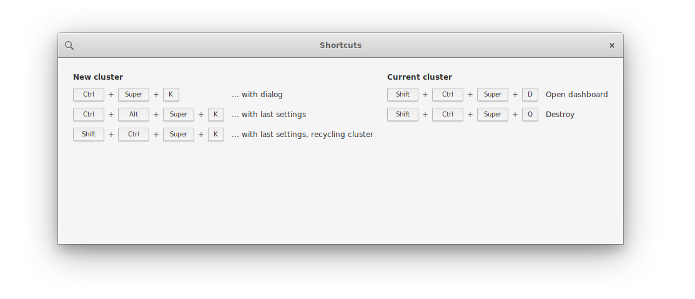

<p align="center">

</p>

# k3x

[](https://travis-ci.org/inercia/k3x)
[](https://www.codacy.com/manual/inercia/k3x?utm_source=github.com&amp;utm_medium=referral&amp;utm_content=inercia/k3x&amp;utm_campaign=Badge_Grade)
[](https://opensource.org/licenses/mit-license.php)
[](https://gitHub.com/inercia/k3x/releases/)

_k3x_ is a graphical user interface for [k3d](https://github.com/rancher/k3d),
making it trivial to have your own local [Kubernetes](https://kubernetes.io/) cluster(s).

_k3x_ is perfect for:

* having a fresh Kubernetes cluster in a couple of seconds.
* trying new deployments before going in production.
* learning about Kubernetes.

_k3x_ goals are:

* to create/switch-to/destroy Kubernetes clusters easily.
* to drive the most important operations with global keyboard shortcuts.
* to reduce the learning curve of using Kubernetes.

## Documentation

* Detailed [installation instructions](docs/user-manual-installation.md).
* [Creating a new cluster](docs/user-manual-creating-a-new-cluster.md).
* [Preferences](docs/user-manual-preferences.md).
* [Frequently asked questions](docs/faq.md) and troubleshooting.

## Quick start

### Pre-requisites

* A **Docker** daemon. It can be both a local or a remote one... but things
  are easier with a local one. Follow [these instructions](https://docs.docker.com/engine/install/)
  for installing Docker in your machine.
* Some Linux distribution where you can install **[Flatpak](https://flatpak.org) packages**.
  Most modern linux distros have built-in support, but you can find more details on
  _flatpaks_ in our [installation instructions](docs/user-manual-installation.md#adding-flatpak-support-in-your-os).

### Installing _k3x_

The preferred installation method is from the Flathub. Just visit the [_k3x_ page at the Flathub](https://flathub.org/apps/details/com.github.inercia.k3x)
(built from [this repo](https://github.com/flathub/com.github.inercia.k3x)) or click in the following link:

<a href='https://flathub.org/apps/details/com.github.inercia.k3x'></a>

From command line, you can install it with

```console
flatpak remote-add --user --if-not-exists flathub https://flathub.org/repo/flathub.flatpakrepo
flatpak install --user flathub com.github.inercia.k3x
```

You can also use one of the `.flatpak` files provided in [our releases page](https://github.com/inercia/k3x/releases)
but you should first take a look at the [instructions for your distro](docs/user-manual-installation.md#notes-on-some-linux-distributions)
for some peculiarities.

### Running _k3x_

Once _k3x_ is installed it should be available from your _launcher_ (ie, the GNOME Shell, your
_Applications menu_, etc.). But you can also run it from the command line with:

```console
flatpak run --user com.github.inercia.k3x
```

This also print the application log when started from the terminal, useful for debugging.
Check out the [troubleshooting guide](docs/faq.md) if something goes wrong.

Once _k3x_ is running you will see a new icon in your _system tray_ that will unroll
a menu when clicked:



By clicking in the

* `New cluster...` you will open the [cluster creation](docs/user-manual-creating-a-new-cluster.md) dialog.
* `Preferences` will open the [application settings](docs/user-manual-preferences.md) window.

And you could also try master the global keyboard shortcuts for quicly creating/destroying clusters with a keystroke.



## Contributing to _k3x_

* First, make sure the
  [`flatpak-builder`](https://docs.flatpak.org/en/latest/flatpak-builder.html)
  is available in your machine.
* You can _fork_ and _clone_ this repo (if you plan to contribute) or just _download_
  it in some directory in your laptop.
* Then you can run it with:
  ```console
  make run
  ```
