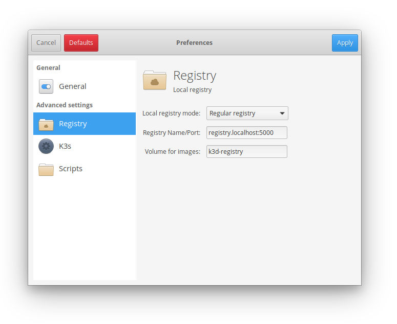
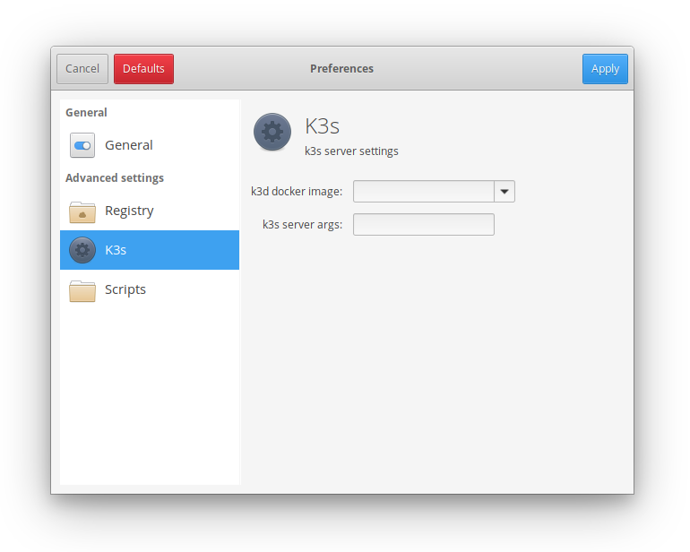
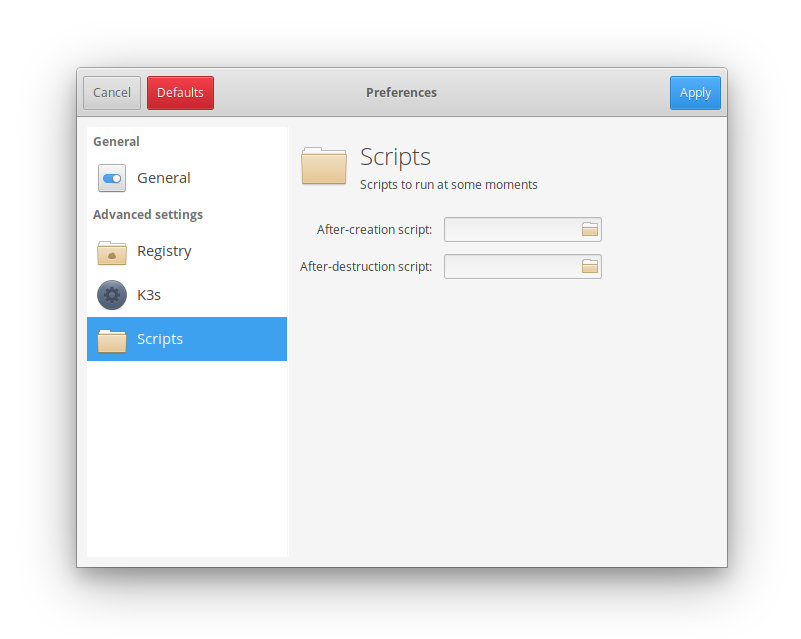

# Preferences

_NOTE: k3x is changing rapidly, so some of the screenshots shown in this page
could not correspond to the real state of the application._
 
## General settings


In this pane you can specify:
 
* the **kubeconfig** file. This file will be fully managed by k3x, and
  that mean that **any previous content will be overwritten**. If you are
  using some other tools that write in this file (like some Cloud providers tools
  like `gcloud` for GKE or `az` for Azure) you should use a separate
  _kubeconfig_ file. For example, you could specify `$HOME/.kube/k3dconfig`.
  You could also simplify your workflow by defining your `KUBECONFIG`
  variable as a [colon-separated list of kubeconfig files](https://kubernetes.io/docs/concepts/configuration/organize-cluster-access-kubeconfig/#the-kubeconfig-environment-variable),
  like:
  ```commandline
  $ export KUBECONFIG="$HOME/.kube/config:$HOME/.kube/k3dconfig"
  ``` 
  and add this line to your `~/.bashrc` file (depending on your shell).

* the **Docker URL**

* a checkbox for starting _k3x_ automatically on login.
 
## Registry



In this pane you can control the configuration for the local registry.

* the **local registry mode** allows to select one of the two options
  for running a local registry:
  
  * To create a fully functional, **regular local registry**.
    You will be able to `push` to this registry, and images in this registry
    will be usable from the Kubernetes cluster.
  * To create a **_caching-only_ registry**. This registry will be used as a
    pull-through cache that will save all the images downloaded from the
    Docker Hub, but you will not be able to `push` to this registry. 
  
* the **registry name and port** can be used for customizing the hostname
  where the registry will be available, as well as the port where it will
  listen. Regarding the hostname, it is important to note that:
    * a container running in Docker should be able to resolve this
      registry DNS name. Otherwise they will not be able to `pull` images
      from there.
    * your laptop should also be able to resolve this name or you will not
      be able to `push` images to this registry.
        
  So, depending on the Docker daemon you are using:
  
    * when using a **local Docker daemon**, a `*.localhost` names is
      [automatically resolved to `127.0.0.1` in modern Linux distributions](https://tools.ietf.org/html/draft-west-let-localhost-be-localhost-06),
      so that will automatically work.
    * when using a **remote Docker daemon**, you should choose a hostname
      that can be resolved in the containers in your Docker daemon as well as
      in your laptop.  

* the Docker **volume** used for for storing the images in the registry.

#### Registry: checking that you local registry works

You can check that the local registry is working by `pull`ing a `busybox`
image and tagging it with the name of your registry.

```commandline
$ docker pull busybox:latest
$ docker tag busybox:latest registry.localhost:5000/busybox:latest
```

Then you can push this image to your local registry:

```commandline
$ docker push registry.localhost:5000/busybox:latest
```

And now you can run a simple shell in your cluster with the image
you have pushed to the local registry:

```commandline
$ kubectl run -i --tty --rm busybox --image=registry.localhost:5000/busybox --restart=Never -- sh
```

#### Registry: some notes on the creation/destruction

The local registry is shared between all the clusters created. The creation
of the registry will be triggered when you create the first cluster that needs it,
and it will be destroyed when no more clusters are using it.

## K3S



The K3s panel provides some options for:

* the **K3s Docker image**. You can use this for forcing an specific
  Docker image for running your cluster nodes. This can be useful if you
  want to run a different version of Kubernetes, for example when testing
  backwards compatibility with previous version of Kubernetes.
  You can get the list of official K3S images
  [here](https://hub.docker.com/r/rancher/k3s/tags).
* some optional **K3s server arguments**. You can check the list of
  configuration arguments in the official 
  [K3s Server Configuration Reference](https://rancher.com/docs/k3s/latest/en/installation/install-options/server-config/). 
 
## Scripts



The _scripts_ section gives you the opportunity to run some scripts at some
moments in the lifetime of your clusters, like:

* an **after-creation** script.
* an **after-destruction** script.

Some information is passed to these scripts as environment variables:

* `K3X_ACTION`: `create` or `destroy`
* `K3X_CLUSTER_NAME`: the name of them cluster (ie, `k3s-cluster-643`)

The following environment variables are available only when the cluster has been created:

* `K3X_REGISTRY_ENABLED`: non-empty when the registry is enabled.
* `K3X_REGISTRY_NAME`: name of the registry (ie, `registry.localhost`).
* `K3X_REGISTRY_PORT`: port of the registry (ie, `5000`).
* `K3X_MASTER_IP`: the master IP address (ie, `172.26.0.3`).
* `K3X_KUBECONFIG`: a `kubeconfig` file specific to this cluster (ie, `/home/user/.config/k3d/k3s-cluster-643/kubeconfig.yaml`).

Some considerations when using your scripts:

- The cluster can be destroyed at any time. It could even be destroyed
  before your script has the chance to run. So do not assume the cluster
  is there.
- Generally speaking, your script should not take too much time to run,
  let alone to block. Once it is executed, it should return as soon as
  possible.
- The script does not have _root_ privileges. If you need to run commands
  as root, we recommend runing them with `sudo` and enabling password-less
  execution for those commands.
  